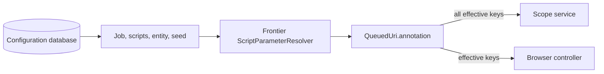

# Script parameter resolution

Veidemann's implemented script-parameter mechanism uses `Meta.annotation` on
configuration objects. The `BrowserConfig.script_parameters` protobuf field is
marked `Not implemented` and is not read by the resolution code.

Each browser or scope script declares its accepted parameter keys, and their
default string values, as annotations on the script's `Meta`. The resolver
builds one effective key/value map for a crawl job and, when requested, a seed.
Only keys declared by one of the active scripts enter that map. Job, entity, or
seed annotations cannot add an otherwise undeclared key.

## Resolution order

The effective map is built in the following order. A value applied later wins
when the same key already exists.

1. Annotations on the crawl job's scope script.
2. Annotations on browser scripts explicitly referenced by the crawl job's
   `CrawlConfig -> BrowserConfig -> script_ref` chain. References are processed
   in list order.
3. Annotations on browser scripts selected by the browser config's
   `script_selector` values. The database result order determines the winner if
   selected scripts declare the same key, so duplicate keys between scripts
   should be avoided.
4. Annotations on the crawl job itself, but only where the key was declared by
   an active script in steps 1-3.
5. Annotations on the seed's referenced entity, if it has one, again only for
   already-declared keys.
6. Annotations on the seed itself, again only for already-declared keys.

The resulting precedence is therefore generally:

```text
seed > entity > crawl job > active script default
```

There are two qualifications:

- Conflicts between active scripts are resolved by processing order, not by
  script type. A later browser-script default can overwrite a scope-script or
  earlier browser-script default with the same key.
- The result is held in a hash map. Consumers must treat it as an unordered set
  of unique keys; CLI, API, and UI output order is not guaranteed.

### Job-specific entity and seed overrides

Entity and seed annotations can target one crawl job with this key syntax:

```text
{crawl-job-id-or-name}parameter-key
```

For example, `{daily-news}scope_maxHopsFromSeed` applies to the crawl job whose
ID or exact name is `daily-news`. Before returning the result, the prefix is
removed and the annotation replaces `scope_maxHopsFromSeed`.

Within one entity or seed, ordinary matching keys are applied first and
job-specific keys second. Consequently, a matching job-specific value wins
over an ordinary value on the same object. Entity overrides are resolved
before seed overrides, so a seed value still has final precedence. A targeted
annotation is ignored when the job does not match or the unprefixed key was not
declared by an active script. A key beginning with `{` but lacking a closing
`}` causes resolution to fail with `IllegalArgumentException`.

## Runtime data flow



Frontier resolves the parameters when it creates the seed `QueuedUri`, again
during pre-fetch, and during post-fetch for discovered outlinks. It copies the
effective annotations into `QueuedUri.annotation` before calling the scope
service or handing a page-harvest specification to the browser controller.
This repeated resolution means configuration changes can affect later
pre-fetches or outlinks in an already-running crawl; parameters are not a
single immutable snapshot taken when the job starts.

The consumers interpret the resolved annotations differently:

- **Scope service:** copies every `QueuedUri.annotation` entry into the
  Starlark thread as a string. A scope script reads a value with
  `param('key')`. Requesting a missing key is a script error.
- **Browser controller:** for each browser script, filters the effective
  annotations to keys declared in that script's own `Meta.annotation` and
  passes them as a JSON object to the JavaScript function. For a chain of
  runtime scripts, values in the previous script's returned `data` object
  override resolved annotation values and may introduce additional keys.

## Inspection and involved components

| Component | Responsibility |
| --- | --- |
| Config API protobuf | Defines `Meta.annotation`, `GetScriptAnnotations`, and the unused `BrowserConfig.script_parameters` field. |
| Configuration database / `ConfigAdapter` | Loads the referenced job, crawl config, browser config, scripts, entity, and seed; selects scripts by labels. |
| Controller `JobExecutionUtil` | Implements the merge for the read/preview API. |
| Controller `ConfigService` | Exposes the merge as the `GetScriptAnnotations` gRPC method. |
| Dashboard | Calls `GetScriptAnnotations` to preview job- and seed-effective values. |
| `veidemannctl` | `veidemannctl script-parameters JOB-ID [SEED-ID]` prints the same Controller result. The arguments are IDs, despite job names being valid inside targeted annotation prefixes. |
| Frontier `ScriptParameterResolver` | Independently implements the runtime merge and attaches its result to queued URIs. |
| Scope service | Makes all queued-URI annotations available to Starlark `param()`. |
| Browser controller | Compiles per-script JSON arguments from queued-URI annotations and script-chain return data. |

Controller and Frontier contain separate implementations of the same merge
rules. Changes to resolution semantics must be made and tested in both places
to keep previews and runtime behavior consistent. One existing difference is
that Controller reports a specific error when a crawl job lacks a scope-script
reference, while Frontier relies on the subsequent config lookup to fail.

To inspect a job's declared defaults plus job overrides:

```sh
veidemannctl script-parameters JOB-ID
```

To include entity and seed overrides:

```sh
veidemannctl script-parameters JOB-ID SEED-ID
```

These commands exercise Controller's preview implementation. They do not read
a persisted runtime snapshot from Frontier.
